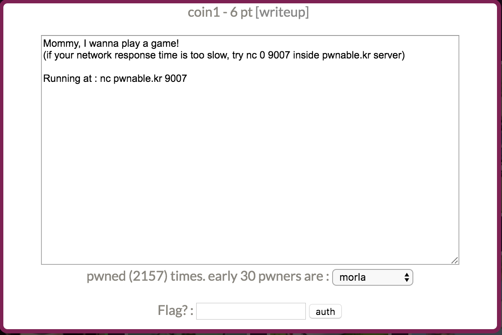

本关主要考察二分查找和pwn脚本编写的能力吧。`nc pwnable.kr 9007` 连接服务器信息如下：

```bash
➜  11-coin1 git:(master) nc pwnable.kr 9007

	---------------------------------------------------
	-              Shall we play a game?              -
	---------------------------------------------------

	You have given some gold coins in your hand
	however, there is one counterfeit coin among them
	counterfeit coin looks exactly same as real coin
	however, its weight is different from real one
	real coin weighs 10, counterfeit coin weighes 9
	help me to find the counterfeit coin with a scale
	if you find 100 counterfeit coins, you will get reward :)
	FYI, you have 60 seconds.

	- How to play -
	1. you get a number of coins (N) and number of chances (C)
	2. then you specify a set of index numbers of coins to be weighed
	3. you get the weight information
	4. 2~3 repeats C time, then you give the answer

	- Example -
	[Server] N=4 C=2 	# find counterfeit among 4 coins with 2 trial
	[Client] 0 1 		# weigh first and second coin
	[Server] 20			# scale result : 20
	[Client] 3			# weigh fourth coin
	[Server] 10			# scale result : 10
	[Client] 2 			# counterfeit coin is third!
	[Server] Correct!

	- Ready? starting in 3 sec... -

N=433 C=9
```

有一些重量是10的金币，但是混了一个重量是9的。已知金币数量N，每次输入编号查询这些金币的重量，最多可以查C次。那么当2^C >= N时，使用二分查找的办法就可以在C次之内找到。

假设N=100，编号0-99，二分为0-49和50-99，如果0-49的重量是500，那么二分搜索50-99，否则继续二分搜索0-49。

使用pwntools编写脚本，注意需要早60s之内查100次，如果来不及ssh之前的关卡，在服务器上跑脚本。其他一点小细节，获取N和C可以用re模块的search或者findall，也可以split(" ")后再split("=")。range(a,b)。

利用脚本如下：

```python
from pwn import *
import re

def binarySearch(left, right):
    middle = int(math.floor( (left+right) / 2.0 ) )
    payload = ' '.join([ str(i) for i in range(left, middle+1 ) ] )
    io.sendline(payload)
    result = io.recvline()
    if 'Correct!' not in result:
	result = int(result)
    else:
	print 'Correct!'
	return
    # print (middle-left + 1)
    if result == 10*(middle -left + 1):
        binarySearch(middle+1, right)
    else:
        binarySearch(left, middle)


def solve(i):
    data = io.recvline()
    log.info("Problem %d : %s" % (i, data) )

    searchObj = re.search("N=(\d*) C=(\d*)", data)
    numberN = int(searchObj.group(1))
    numberC = int(searchObj.group(2))
    if pow(2,numberC) < numberN:
        log.err("cannot solve!")
        exit()

    # print 'start to solve'
    binarySearch(0, numberN-1)

if __name__ == '__main__':
    io = remote('0.0.0.0','9007')
    print io.recv()
    sleep(4)

    for i in range(101):
	if i == 100:
            context.log_level='debug'
        solve(i)
```

输出：

```bash
...
[*] Problem 93 : N=471 C=9
Correct!
[*] Problem 94 : N=46 C=6
Correct!
[*] Problem 95 : N=382 C=9
Correct!
[*] Problem 96 : N=346 C=9
Correct!
[*] Problem 97 : N=932 C=10
Correct!
[*] Problem 98 : N=939 C=10
Correct!
[*] Problem 99 : N=159 C=8
Correct!
[DEBUG] Received 0x37 bytes:
    'Congrats! get your flag\n'
    'b1NaRy_S34rch1nG_1s_3asy_p3asy\n'
[*] Problem 100 : Congrats! get your flag
```

