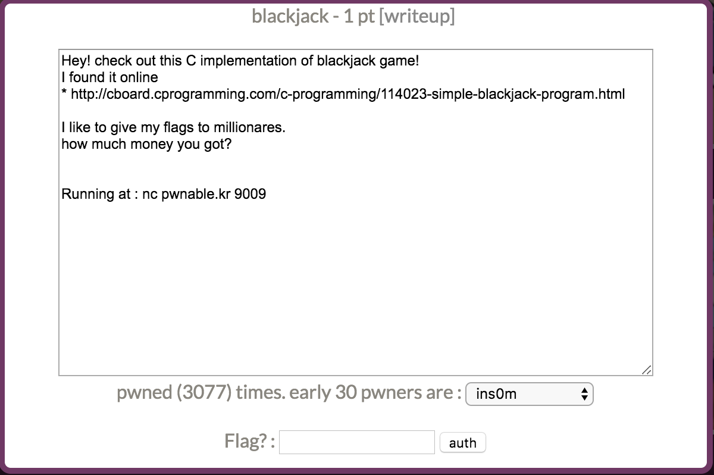

本关是一个blackjack游戏（21点），源码在这里https://cboard.cprogramming.com/c-programming/114023-simple-blackjack-program.html。


看了一下游戏规则，玩家和AI一起玩牌，起初有500块，首先下注，之后每次各自会收到一张随机的牌（点数1-13），最先达到21点的人赢。每次拿到牌之后，你可以选择hit（继续拿牌）或者是stay（不拿）。如果继续拿了牌之后超过21点，那么你就输了。如果你选择stay，那么AI可能拿到超过你的点数赢你，或者超过21点输掉。

我们的目标是每次下注赢到millionare。由于发牌是随机的，不想一直靠运气玩下去的话就来审一下代码吧。

漏洞位置在下注bet这里：

```c
int betting() //Asks user amount to bet
{
 printf("\n\nEnter Bet: $");
 scanf("%d", &bet);
 
 if (bet > cash) //If player tries to bet more money than player has
 {
        printf("\nYou cannot bet more money than you have.");
        printf("\nEnter Bet: ");
        scanf("%d", &bet);
        return bet;
 }
 else return bet;
} // End Function
```

如果下注的钱bet超过了你拥有的钱cash，那么会让你再输入一次，再输入下注的钱的时候居然没有继续判断。

那么，不管你选择stay还是选择hint，输赢对于cash的修改是一致的，以stay为例，赢了cash+bet。输了cash-bet。

```c
void stay() //Function for when user selects 'Stay'
{
     dealer(); //If stay selected, dealer continues going
     if(dealer_total>=17)
     {
      if(player_total>=dealer_total) //If player's total is more than dealer's total, win
      {
         printf("\nUnbelievable! You Win!\n");
         won = won+1;
         cash = cash+bet;
         printf("\nYou have %d Wins and %d Losses. Awesome!\n", won, loss);
         dealer_total=0;
         askover();
      }
      if(player_total<dealer_total) //If player's total is less than dealer's total, loss
      {
         printf("\nDealer Has the Better Hand. You Lose.\n");
         loss = loss+1;
         cash = cash - bet;
         printf("\nYou have %d Wins and %d Losses. Awesome!\n", won, loss);
         dealer_total=0;
         askover();
      }
      ...
      
} // End Function
```

那么cash输入一个负数，继续输，cash=cash-bet。cash输入一个正数，赢一次，cash=cash+bet。

## flag

```
Cash: $500
-------
|C    |
|  5  |
|    C|
-------

Your Total is 5

The Dealer Has a Total of 8

Enter Bet: $501

You cannot bet more money than you have.
Enter Bet: -10000000


Would You Like to Hit or Stay?
Please Enter H to Hit or S to Stay.
s

You Have Chosen to Stay at 5. Wise Decision!

The Dealer Has a Total of 16
The Dealer Has a Total of 24
Dealer Has the Better Hand. You Lose.

You have 0 Wins and 1 Losses. Awesome!

Would You Like To Play Again?
Please Enter Y for Yes or N for No
y
==================================================
YaY_I_AM_A_MILLIONARE_LOL


Cash: $10000500
-------
|S    |
|  1  |
|    S|
-------

Your Total is 1

The Dealer Has a Total of 9

Enter Bet: $
```

嗯，找漏洞的时候需要明确我们的目标，比如cash>1000000，只看cash相关的代码就可以更快一点。