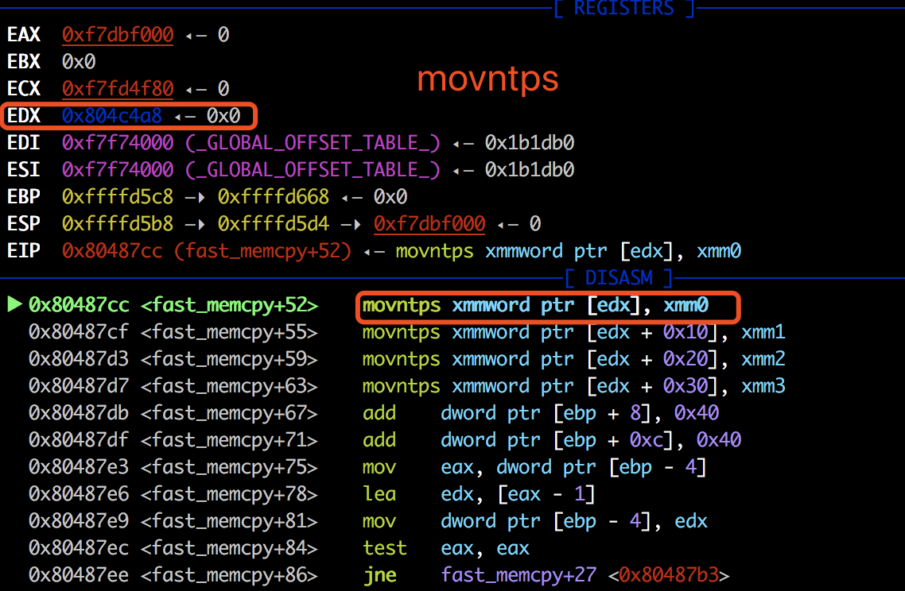

```
memcpy - 10 pt

Are you tired of hacking?, take some rest here.
Just help me out with my small experiment regarding memcpy performance. 
after that, flag is yours.

http://pwnable.kr/bin/memcpy.c

ssh memcpy@pwnable.kr -p2222 (pw:guest)
```

本关看描述似乎是考察的memcpy效率有关的事情，没有给binary，nc之后只能看到readme和源码。

readme内容如下。意思是binary只有memcpy_pwn权限才可以看。netstat 或lsof 查看9022端口对应的进程也查看不到。

```
the compiled binary of "memcpy.c" source code (with real flag) will be executed under memcpy_pwn privilege if you connect to port 9022.
execute the binary by connecting to daemon(nc 0 9022).
```

那么直接看源码吧，源码如下。mmap开辟了内存，调用slow_memcpy 按字节复制，调用fast_memory按64byte复制。分别计算两个函数所用的时间，运行到最后会给出flag。

```c
// compiled with : gcc -o memcpy memcpy.c -m32 -lm  #-lm 引入libm库 for pow函数[1]
#include <stdio.h>
#include <string.h>
#include <stdlib.h>
#include <signal.h>
#include <unistd.h>
#include <sys/mman.h>
#include <math.h>

unsigned long long rdtsc(){
        asm("rdtsc");
}

char* slow_memcpy(char* dest, const char* src, size_t len){
	int i;
	for (i=0; i<len; i++) {
		dest[i] = src[i];
	}
	return dest;
}

char* fast_memcpy(char* dest, const char* src, size_t len){
	size_t i;
	// 64-byte block fast copy
	if(len >= 64){
		i = len / 64;
		len &= (64-1);
		while(i-- > 0){
			__asm__ __volatile__ (
			"movdqa (%0), %%xmm0\n"
			"movdqa 16(%0), %%xmm1\n"
			"movdqa 32(%0), %%xmm2\n"
			"movdqa 48(%0), %%xmm3\n"
			"movntps %%xmm0, (%1)\n"
			"movntps %%xmm1, 16(%1)\n"
			"movntps %%xmm2, 32(%1)\n"
			"movntps %%xmm3, 48(%1)\n"
			::"r"(src),"r"(dest):"memory");
			dest += 64;
			src += 64;
		}
	}

	// byte-to-byte slow copy
	if(len) slow_memcpy(dest, src, len);
	return dest;
}

int main(void){

	setvbuf(stdout, 0, _IONBF, 0);
	setvbuf(stdin, 0, _IOLBF, 0);

	printf("Hey, I have a boring assignment for CS class.. :(\n");
	printf("The assignment is simple.\n");

	printf("-----------------------------------------------------\n");
	printf("- What is the best implementation of memcpy?        -\n");
	printf("- 1. implement your own slow/fast version of memcpy -\n");
	printf("- 2. compare them with various size of data         -\n");
	printf("- 3. conclude your experiment and submit report     -\n");
	printf("-----------------------------------------------------\n");

	printf("This time, just help me out with my experiment and get flag\n");
	printf("No fancy hacking, I promise :D\n");

	unsigned long long t1, t2;
	int e;
	char* src;
	char* dest;
	unsigned int low, high;
	unsigned int size;
	// allocate memory
	char* cache1 = mmap(0, 0x4000, 7, MAP_PRIVATE|MAP_ANONYMOUS, -1, 0);
	char* cache2 = mmap(0, 0x4000, 7, MAP_PRIVATE|MAP_ANONYMOUS, -1, 0);
	src = mmap(0, 0x2000, 7, MAP_PRIVATE|MAP_ANONYMOUS, -1, 0);

	size_t sizes[10];
	int i=0;

	// setup experiment parameters
	for(e=4; e<14; e++){	// 2^13 = 8K
		low = pow(2,e-1);
		high = pow(2,e);
		printf("specify the memcpy amount between %d ~ %d : ", low, high);
		scanf("%d", &size);
		if( size < low || size > high ){
			printf("don't mess with the experiment.\n");
			exit(0);
		}
		sizes[i++] = size;
	}

	sleep(1);
	printf("ok, lets run the experiment with your configuration\n");
	sleep(1);

	// run experiment
	for(i=0; i<10; i++){
		size = sizes[i];
		printf("experiment %d : memcpy with buffer size %d\n", i+1, size);
		dest = malloc( size );

		memcpy(cache1, cache2, 0x4000);		// to eliminate cache effect ？？？
		t1 = rdtsc();
		slow_memcpy(dest, src, size);		// byte-to-byte memcpy
		t2 = rdtsc();
		printf("ellapsed CPU cycles for slow_memcpy : %llu\n", t2-t1);

		memcpy(cache1, cache2, 0x4000);		// to eliminate cache effect ？？？
		t1 = rdtsc();
		fast_memcpy(dest, src, size);		// block-to-block memcpy
		t2 = rdtsc();
		printf("ellapsed CPU cycles for fast_memcpy : %llu\n", t2-t1);
		printf("\n");
	}

	printf("thanks for helping my experiment!\n");
	printf("flag : ----- erased in this source code -----\n");
	return 0;
}
```

直接nc到服务器上之后发现，在第五个实验，fast_memcpy的时候出了问题。

```bash
memcpy@ubuntu:~$ nc 0 9022
Hey, I have a boring assignment for CS class.. :(
The assignment is simple.
-----------------------------------------------------
- What is the best implementation of memcpy?        -
- 1. implement your own slow/fast version of memcpy -
- 2. compare them with various size of data         -
- 3. conclude your experiment and submit report     -
-----------------------------------------------------
This time, just help me out with my experiment and get flag
No fancy hacking, I promise :D
specify the memcpy amount between 8 ~ 16 : 8
specify the memcpy amount between 16 ~ 32 : 16
specify the memcpy amount between 32 ~ 64 : 32
specify the memcpy amount between 64 ~ 128 : 64
specify the memcpy amount between 128 ~ 256 : 128
specify the memcpy amount between 256 ~ 512 : 256
specify the memcpy amount between 512 ~ 1024 : 512
specify the memcpy amount between 1024 ~ 2048 : 1024
specify the memcpy amount between 2048 ~ 4096 : 2048
specify the memcpy amount between 4096 ~ 8192 : 4096
ok, lets run the experiment with your configuration
experiment 1 : memcpy with buffer size 8
ellapsed CPU cycles for slow_memcpy : 1551
ellapsed CPU cycles for fast_memcpy : 540

experiment 2 : memcpy with buffer size 16
ellapsed CPU cycles for slow_memcpy : 342
ellapsed CPU cycles for fast_memcpy : 441

experiment 3 : memcpy with buffer size 32
ellapsed CPU cycles for slow_memcpy : 534
ellapsed CPU cycles for fast_memcpy : 654

experiment 4 : memcpy with buffer size 64
ellapsed CPU cycles for slow_memcpy : 960
ellapsed CPU cycles for fast_memcpy : 135

experiment 5 : memcpy with buffer size 128
ellapsed CPU cycles for slow_memcpy : 1812
memcpy@ubuntu:~$
```

本地编译一下，gdb挂上看一下crash信息是在movntps[3]这个指令。在fast_memcpy时，movntps将源操作数（XMM寄存器）的内容copy给目的操作数（edx指向的内存）。根据movntps指令的描述信息[3]得知该指令的内存操作数对齐必须16byte对齐(IDA中也可以看到操作的数是128bit 也就是16byte)。这也就明白了为什么下面的crash信息了，因为0x804c4a8没有16byte对齐。

> The memory operand must be aligned on a 16-byte (128-bit version), 32-byte (VEX.256 encoded version) or 64-byte (EVEX.512 encoded version) boundary otherwise a general-protection exception (#GP) will be generated.




edx指向的内存在堆中，根据glibc 管理堆块的数据结构叫malloc_chunk，长这样：

```c
  struct malloc_chunk {

  INTERNAL_SIZE_T      prev_size;  /* Size of previous chunk (if free).  */
  INTERNAL_SIZE_T      size;       /* Size in bytes, including overhead. */

  struct malloc_chunk* fd;         /* double links -- used only if free. */
  struct malloc_chunk* bk;

  /* Only used for large blocks: pointer to next larger size.  */
  struct malloc_chunk* fd_nextsize; /* double links -- used only if free. */
  struct malloc_chunk* bk_nextsize;
};
/*
  An allocated chunk looks like this:


    chunk-> +-+-+-+-+-+-+-+-+-+-+-+-+-+-+-+-+-+-+-+-+-+-+-+-+-+-+-+-+-+-+-+-+
	    |             Size of previous chunk, if allocated            | |
	    +-+-+-+-+-+-+-+-+-+-+-+-+-+-+-+-+-+-+-+-+-+-+-+-+-+-+-+-+-+-+-+-+
	    |             Size of chunk, in bytes                       |M|P|
      mem-> +-+-+-+-+-+-+-+-+-+-+-+-+-+-+-+-+-+-+-+-+-+-+-+-+-+-+-+-+-+-+-+-+
	    |             User data starts here...                          .
	    .                                                               .
	    .             (malloc_usable_size() bytes)                      .
	    .                                                               |
nextchunk-> +-+-+-+-+-+-+-+-+-+-+-+-+-+-+-+-+-+-+-+-+-+-+-+-+-+-+-+-+-+-+-+-+
	    |             Size of chunk                                     |
	    +-+-+-+-+-+-+-+-+-+-+-+-+-+-+-+-+-+-+-+-+-+-+-+-+-+-+-+-+-+-+-+-+
	    
	    
*/
```

当malloc的size>=64时，会调用fast_memcpy。size=64，malloc返回的位置是0x804c460，size=128，malloc返回的位置是0x804c4a8。因此，需要修改size=64时的size，比如修改成64+8=72，让malloc 128返回的地址是16的倍数，如0x804c4b0。

```
pwndbg> x/600wx 0x804c400
0x804c400:	0x00000000	0x00000000	0x00000000	0x00000011 //8
0x804c410:	0x00000000	0x00000000	0x00000000	0x00000019 //16
0x804c420:	0x00000000	0x00000000	0x00000000	0x00000000
0x804c430:	0x00000000	0x00000029	0x00000000	0x00000000 //32
0x804c440:	0x00000000	0x00000000	0x00000000	0x00000000
0x804c450:	0x00000000	0x00000000	0x00000000	0x00000049 //64
0x804c460:	0x00000000	0x00000000	0x00000000	0x00000000
0x804c470:	0x00000000	0x00000000	0x00000000	0x00000000
0x804c480:	0x00000000	0x00000000	0x00000000	0x00000000
0x804c490:	0x00000000	0x00000000	0x00000000	0x00000000
0x804c4a0:	0x00000000	0x00000089	0x00000000	0x00000000 //128
0x804c4b0:	0x00000000	0x00000000	0x00000000	0x00000000
0x804c4c0:	0x00000000	0x00000000	0x00000000	0x00000000
```

本质上，只需要chunk的地址是0x8结尾即可，malloc的返回的地址加上chunk head就是0x10。假设64～128的chunk size的地址为8，可写出如下脚本计算要输入的size：

```python
#!/usr/bin/python

prev_size = 4
align_length = 2 * prev_size

def get_malloc_chunk_size(size):
    data_size = 0
    if size < align_length + prev_size:  # < 2*4+4
        data_size = align_length
    else:
        if (size  - (size / align_length) * align_length) > prev_size:
            data_size = align_length * (1 + size / align_length)
        else:
            data_size = align_length * (size / align_length)

    return 2 * prev_size + data_size # chunk_header  + data_size

def check_addr(addr):
    if addr & 0x8 == 0x8:
        return True
    else:
        return False

if __name__ == '__main__':
    addr = 8
    for i in xrange(6,13,1): # 6 7 8 9 10 11 12
        print pow(2,i), ' <= size < ', pow(2,i+1)

        chunk_size = get_malloc_chunk_size(pow(2,i))
        addr = chunk_size + addr
        if check_addr(addr):
            print '  Correct, input :' ,pow(2,i)
            # print 'Size: ', pow(2,i)
        else:
            print '  failed, input :', pow(2,i)+8
            addr += 8
            # print '+8 Now addr:', addr
```

输出：

```bash
$ python malloc_size.py
64  <= size <  128
  failed, input : 72
128  <= size <  256
  failed, input : 136
256  <= size <  512
  failed, input : 264
512  <= size <  1024
  failed, input : 520
1024  <= size <  2048
  failed, input : 1032
2048  <= size <  4096
  failed, input : 2056
4096  <= size <  8192
  failed, input : 4104
```

写完这个脚本发现了一个trick，malloc的chunk是8byte对齐的，如果当前size的chunk不满足条件，size+8之后的chunk肯定符合条件。XD


## flag

```bash
➜  ~ nc pwnable.kr 9022
Hey, I have a boring assignment for CS class.. :(
The assignment is simple.
-----------------------------------------------------
- What is the best implementation of memcpy?        -
- 1. implement your own slow/fast version of memcpy -
- 2. compare them with various size of data         -
- 3. conclude your experiment and submit report     -
-----------------------------------------------------
This time, just help me out with my experiment and get flag
No fancy hacking, I promise :D
specify the memcpy amount between 8 ~ 16 : 8
specify the memcpy amount between 16 ~ 32 : 16
specify the memcpy amount between 32 ~ 64 : 32
specify the memcpy amount between 64 ~ 128 : 72
specify the memcpy amount between 128 ~ 256 : 136
specify the memcpy amount between 256 ~ 512 : 264
specify the memcpy amount between 512 ~ 1024 : 520
specify the memcpy amount between 1024 ~ 2048 : 1032
specify the memcpy amount between 2048 ~ 4096 : 2056
specify the memcpy amount between 4096 ~ 8192 : 4104
ok, lets run the experiment with your configuration
experiment 1 : memcpy with buffer size 8
ellapsed CPU cycles for slow_memcpy : 2271
ellapsed CPU cycles for fast_memcpy : 357

experiment 2 : memcpy with buffer size 16
ellapsed CPU cycles for slow_memcpy : 309
ellapsed CPU cycles for fast_memcpy : 303

experiment 3 : memcpy with buffer size 32
ellapsed CPU cycles for slow_memcpy : 519
ellapsed CPU cycles for fast_memcpy : 504

experiment 4 : memcpy with buffer size 72
ellapsed CPU cycles for slow_memcpy : 1056
ellapsed CPU cycles for fast_memcpy : 240

experiment 5 : memcpy with buffer size 136
ellapsed CPU cycles for slow_memcpy : 1917
ellapsed CPU cycles for fast_memcpy : 267

experiment 6 : memcpy with buffer size 264
ellapsed CPU cycles for slow_memcpy : 3621
ellapsed CPU cycles for fast_memcpy : 270

experiment 7 : memcpy with buffer size 520
ellapsed CPU cycles for slow_memcpy : 7194
ellapsed CPU cycles for fast_memcpy : 336

experiment 8 : memcpy with buffer size 1032
ellapsed CPU cycles for slow_memcpy : 13878
ellapsed CPU cycles for fast_memcpy : 474

experiment 9 : memcpy with buffer size 2056
ellapsed CPU cycles for slow_memcpy : 27573
ellapsed CPU cycles for fast_memcpy : 846

experiment 10 : memcpy with buffer size 4104
ellapsed CPU cycles for slow_memcpy : 59736
ellapsed CPU cycles for fast_memcpy : 1638

thanks for helping my experiment!
flag : 1_w4nn4_br34K_th3_m3m0ry_4lignm3nt
```


## 参考

1. -lm参数 https://blog.csdn.net/Aguangg_6655_la/article/details/62042810
2. RDSTC https://blog.csdn.net/gonxi/article/details/6104842
3. movntps https://www.felixcloutier.com/x86/MOVNTPS.html
4. glibc chunk https://paper.seebug.org/445/
5. pwnable.kr memcpy https://blog.csdn.net/pwd_3/article/details/78088583