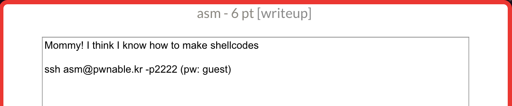
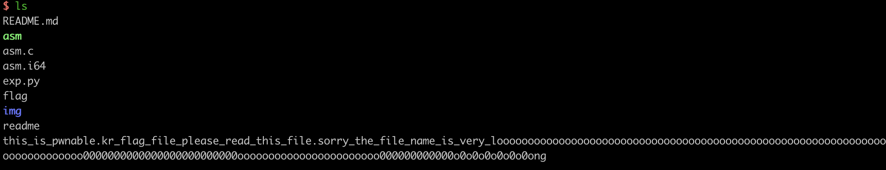
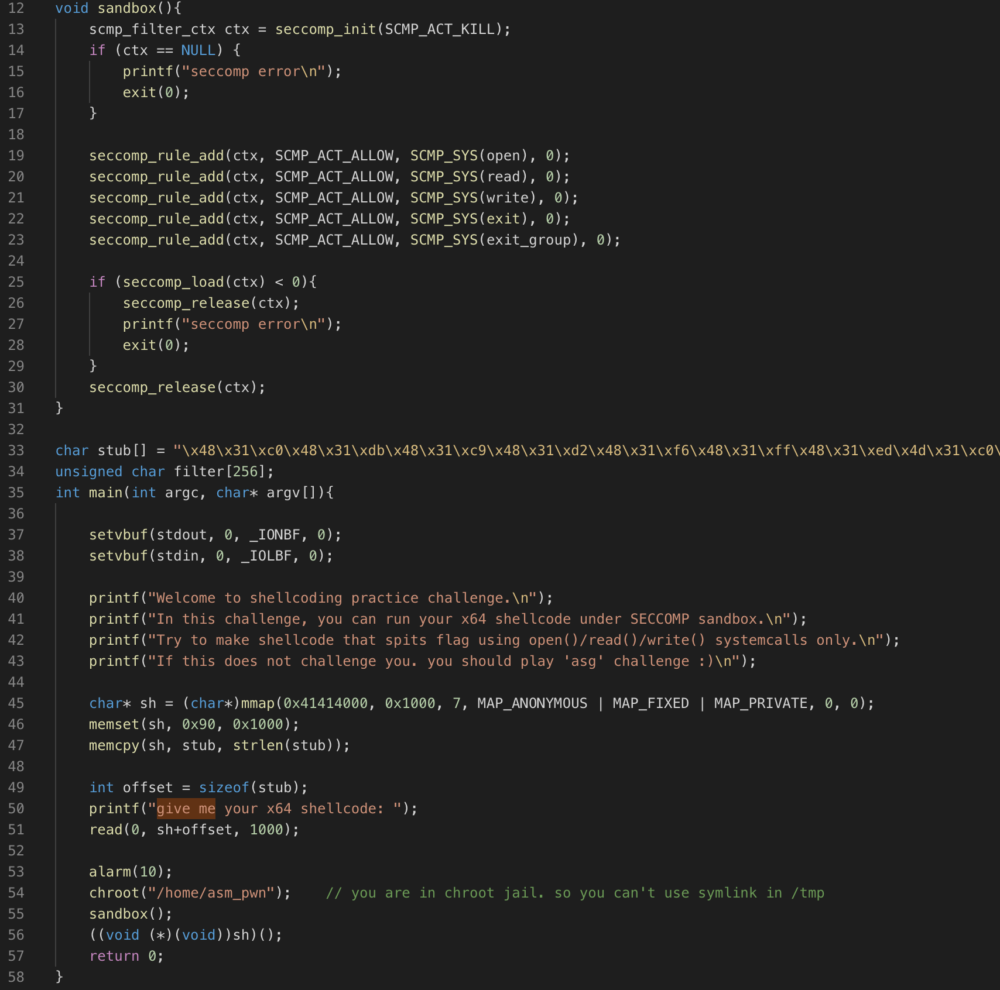
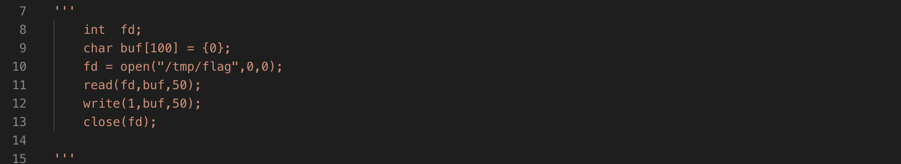
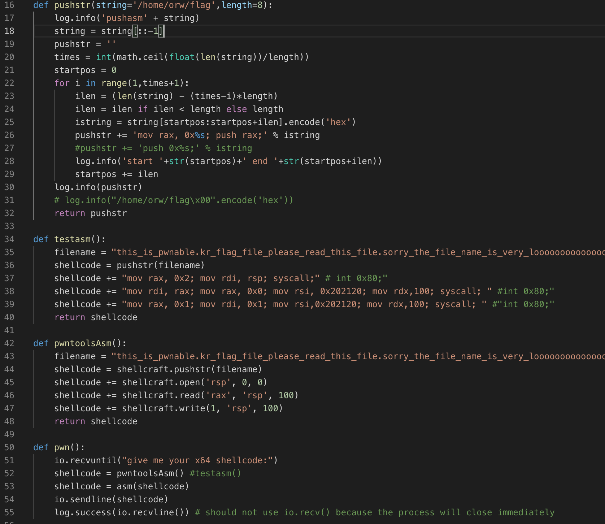
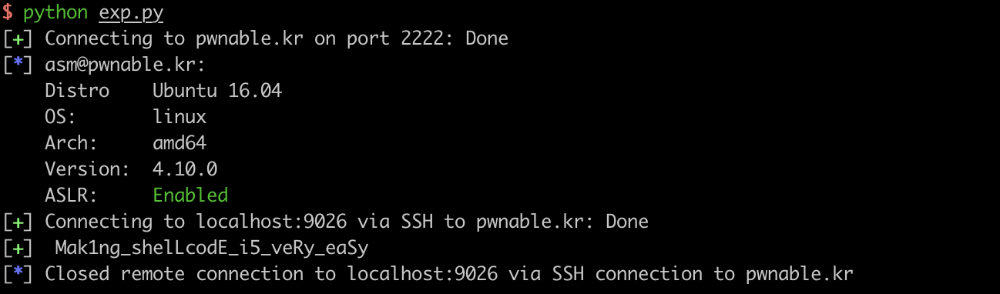

## 题目信息

nc之后查看信息如下。根据readme提示，本关是要求登陆服务器后，nc 9026端口连接asm程序来读flag。flag文件名很长。

看了源码发现程序做了如下操作。mmap了一块内存读取shellcode并执行，开启了seccomp沙箱[1]，限制只能使用open read write exit exit_group系统调用。因此本关就是利用这些系统调用来写64位下读flag的shellcode。

可以通过`cat /proc/self/status |grep -i seccom`查看当前系统是否打开了seccom沙箱。

## exp

读取flag的shellcode思路如下：

x64的部分系统调用参考[2]。本来自己手写汇编，push 字符串到栈上，再调用pwntools的asm生成机器码。遇到了两个问题：

- 第一个问题：即使设置了arch为amd64，pwntools asm(push number)，number如果超过4字节会报错。用mov再push解决	。
- 第二个问题：64位下调用系统调用需要用syscall而不是int 0x80。

部分exploit：

PS：这题之前没有调试，间隔了很久才写了wp，感兴趣的可以去做做pwnable.tw上的orw，一个是32位，一个64位，利用思路一样。

此外，以后代码或者输出准备尽量用图片了，虽然占用一点空间，但是读起来舒服一点。

## 参考

1. seccomp https://blog.csdn.net/mashimiao/article/details/73607485
2. syscall x64  http://www.csyssec.org/20161231/systemcall64list/