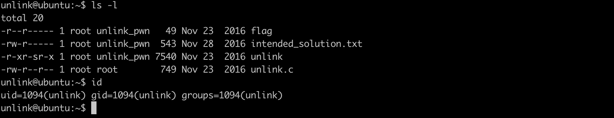
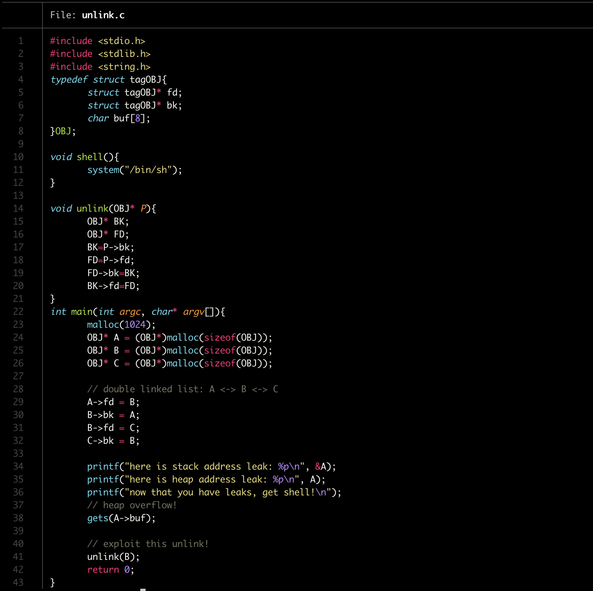
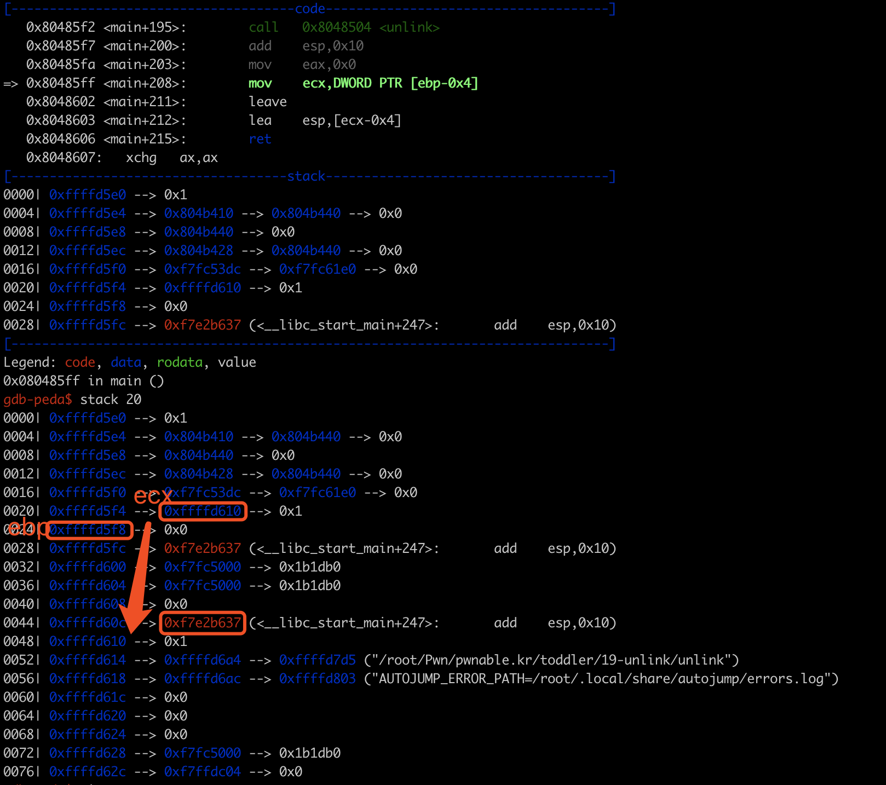
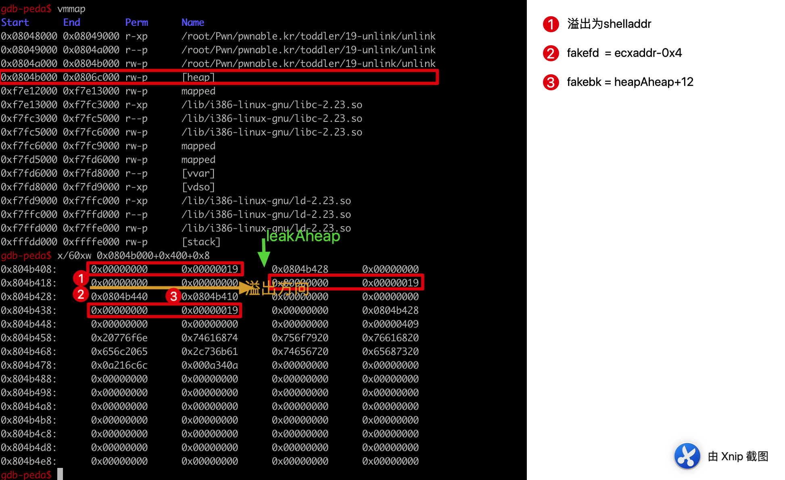
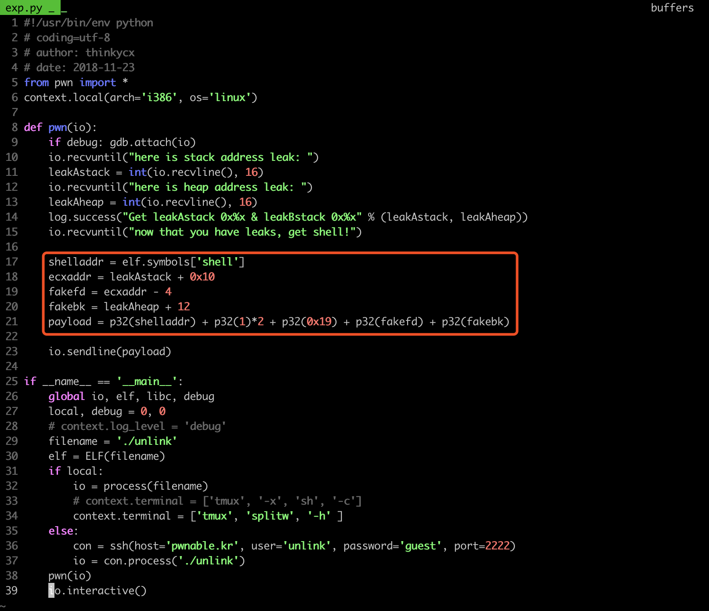
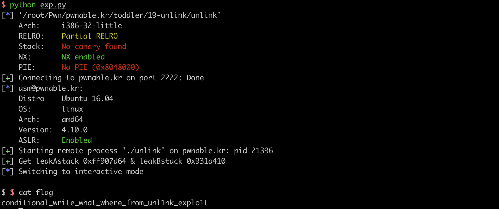

## 题目信息



直接看源码：



这题思路很清晰，程序模拟了最简单的unlink过程，**unlink**的本质就是把中间的chunk从前后解链，同时修改前面chunk的fd和后面chunk的bk。如果可以溢出了会被unlink的chunk，32bit下在FD->bk=BK时，拥有一次4bit写的机会，同时需要保证BK->fd可写（BK->fd=FD同理）。

拥有任意地址写的机会后，可以考虑修改程序返回地址为shelladdr就可以拿shell。程序是如何返回的？main函数中ret时取返回地址的操作如下（见下图）：

```asm
   0x80485ff <main+208>:        mov    ecx,DWORD PTR [ebp-0x4]
   0x8048602 <main+211>:        leave
   0x8048603 <main+212>:        lea    esp,[ecx-0x4]
   0x8048606 <main+215>:        ret
```

从[ebp-0x4]中取ecx后，从[ecx-4]的地方取出main_retaddr。



如果要写main_retaddr为shell，需要控制unlink时FD=&main_retaddr（0xffffd60c）-4，控制BK为&shell，那么FD->bk=BK执行时 ，两边同时替换，&main_retaddr -4 +4= &shell，即*(&main_retaddr)=&shell。但是由于BK->fd=FD，&shell+0在.text不可写，因此BK不能为&shell。

那么是否可以考虑让BK是一个类似jmp &shell的地址呢？gdb中find 0xf7fc5000没有找到任何输出。因此直接修改main_retaddr不可行了。但是由于main_retaddr获取时是通过ecx这个栈上的指针来获取的，因此，我们通过unlink修改栈中ecx的值指向堆中（&shell的堆地址+4），这时BK->fd（&shell的堆地址+4+0）肯定可写，由于堆溢出，堆中的数据我们是可以伪造的，因此就可以劫持程序main_retaddr了。

## exp

A栈地址是ebp-14h，ecx的栈地址是ebp-0x4。假设泄漏的A栈地址为leakAstack，因此unlink时ecx为leakAstack+0x10。要写ecxaddr，因此fakefd为ecxaddr-0x4。
A的堆地址为leakAheap（上图中是0x804b408），溢出时先在leakAheap+0x8处布置&shell，fakebk修改为leakAheap+0x8+0x4。



exploit:






## 总结

unlink的题已经做过好几遍了，时隔一年再做的时候还是得想一下。本质是unlink 4byte写，由于main ret时通过栈上的ecx指针来获取main_retaddr，因此堆中布置&shell，unlink写ecx=(&shell的堆地址+4)，fakefd=ecx-4，从而修改main_retaddr。