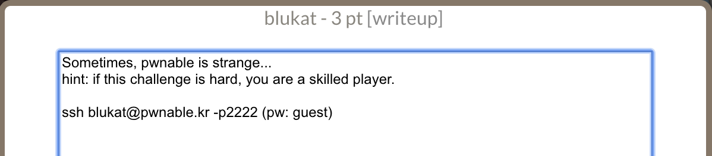
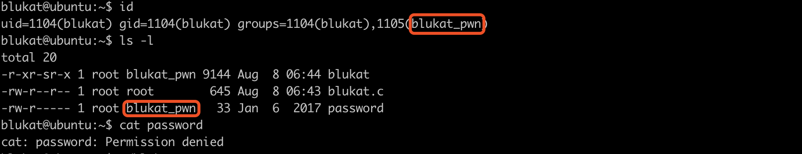
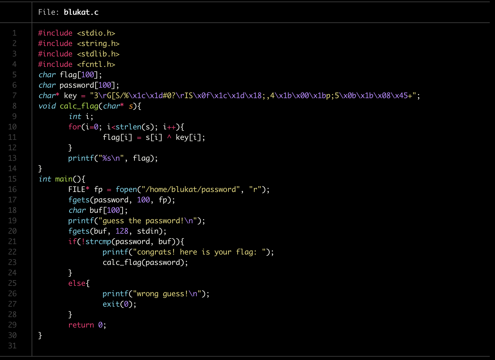
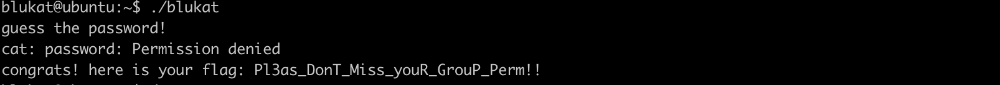

## 本关描述

这一关看着描述就挺奇怪的，scp下来之后居然把password改copy下来了，内容是`cat: password: Permission denied`。照理没有权限读的话是不会copy下来的。ssh上去看一下就明白了（如下图），当前用户在blukat_pwn组，因此是可以读password的。

看一下代码写的没问题，读取password和输入比较，如果比较成功就输出flag。

既然password可以读，那么直接输入就好了…这关的本意应该是要让我们注意权限的问题....

