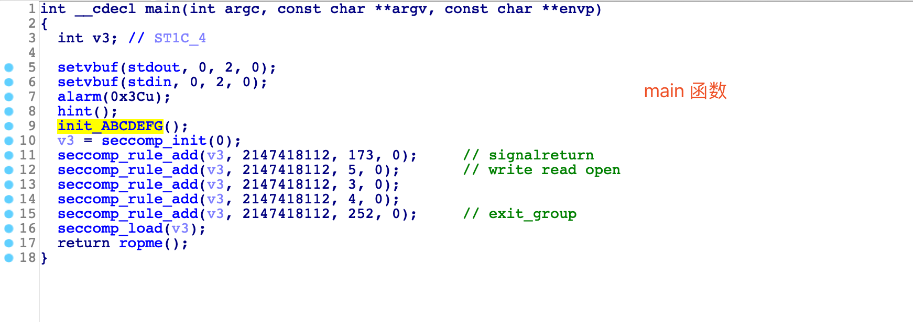
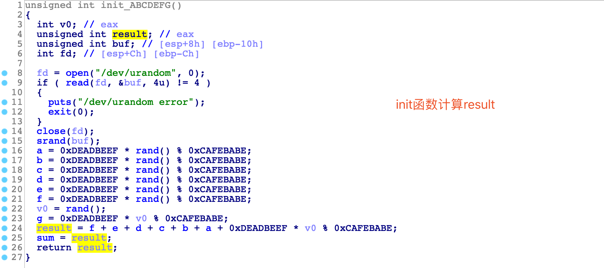
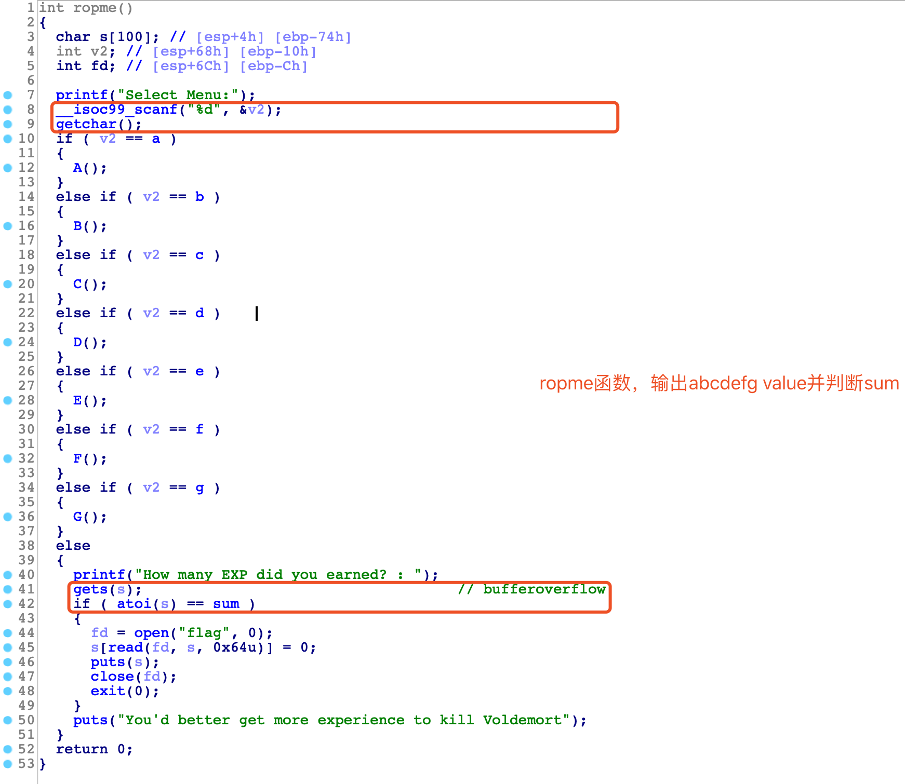
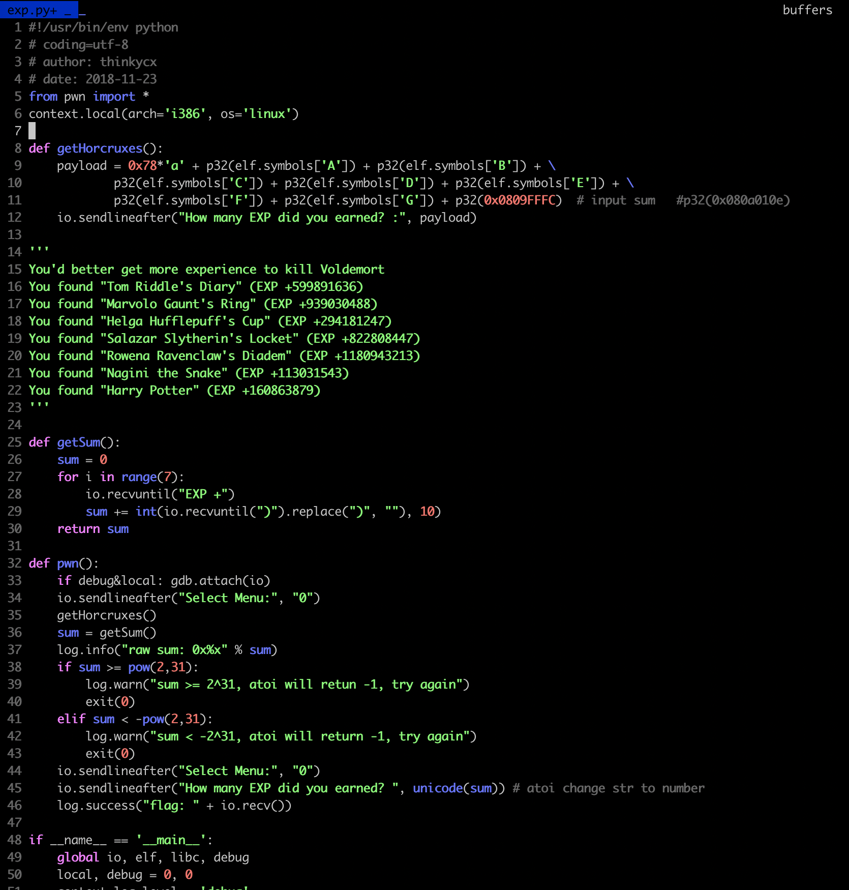
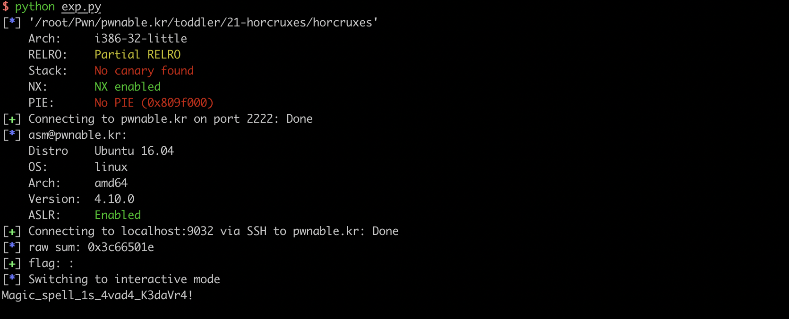

## 本关信息

伏地魔吧自己分裂的灵魂藏在了7哥魂器中…这个描述666。本关要求我们找到所有的魂器然后ROP似乎就可以拿flag了。本关没有给源码，上IDA分析吧。本地运行前安装32位libseccomp库，`apt-get install libseccomp-dev:i386`。

init初始化abcdefg7个int值，保存在bss段，并计算sum。abcdefg的值生成时使用随机数做为种子再调用rand函数生成，因此随机不可预测。

ropme函数输入abcdefg的值，就可以调用相应的打印函数。gets函数输入sum的值就可以进入输出flag的流程。由于gets存在栈溢出，因此可以劫持返回地址。

利用思路很简单，劫持返回地址跳转输出abcdefg的值，就可以计算sum，之后把sum转化成字符串后输入给atoi即可。

注意有几个坑点：

- gets函数遇到a newline character比如\x00 \x0a就会截断，ropme函数起始地址是0x080A0009，不能直接跳转到ropme函数中执行代码。可以直接跳到ABCDEFG函数里面获取abcdefg的值。
- atoi函数将int转化为字符串，如果数字超过int范围转化失败返回-1。

此外，由于0xa不能输入，find查看了stack中是有0x080a的值的，如果栈溢出溢出低位几个字节为打印flag的低位，再rop到该处应该也可以直接读flag。

## exp

