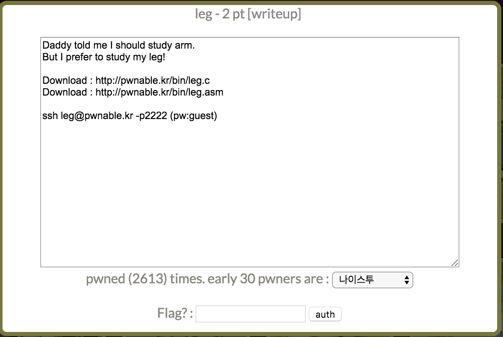
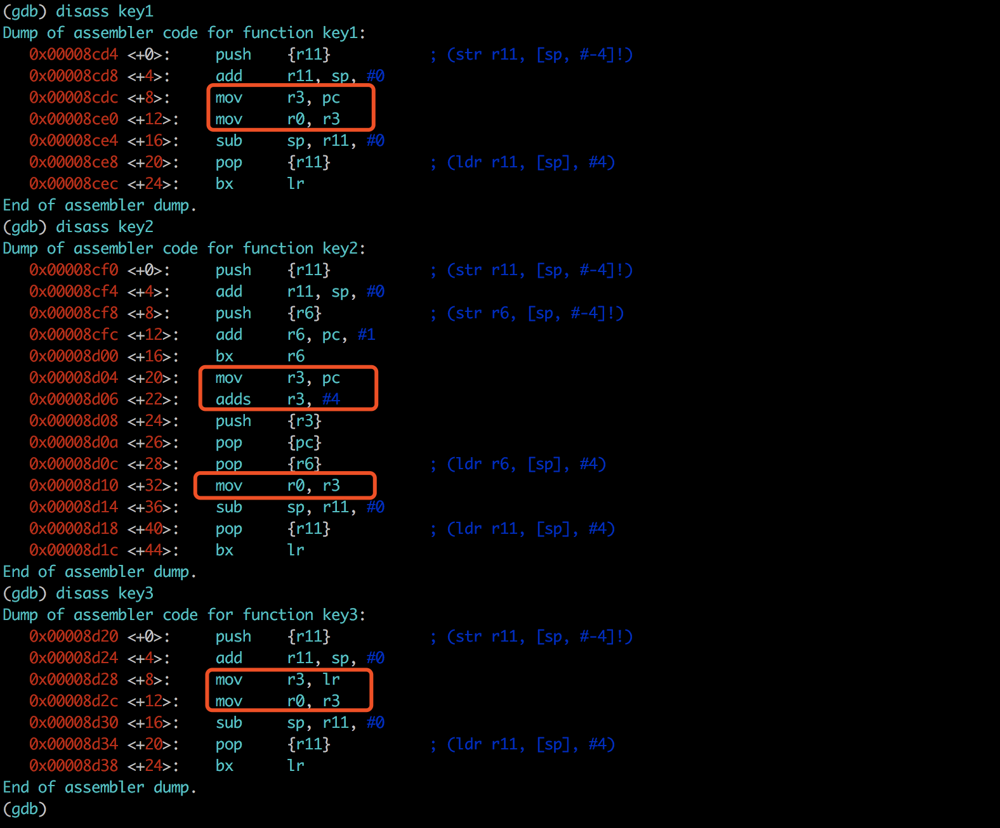
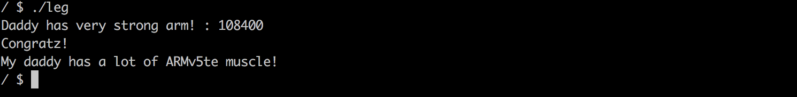

本关主要涉及了一些arm汇编的知识。

阅读leg.c源码发现，本关调用scanf从标准输入读取key后，判断是否和key1 key2 key3 三个函数的返回值的和相等。如果相等，则输出flag。但是ARM汇编的函数返回值和寄存器R0有关，并且key函数中涉及到了PC LR 寄存器的操作。因此需要阅读汇编。

```
int main(){
	int key=0;
	printf("Daddy has very strong arm! : ");
	scanf("%d", &key);
	if( (key1()+key2()+key3()) == key ){
		printf("Congratz!\n");
		int fd = open("flag", O_RDONLY);
		char buf[100];
		int r = read(fd, buf, 100);
		write(0, buf, r);
	}
	else{
		printf("I have strong leg :P\n");
	}
	return 0;
}
```

阅读leg.asm的汇编。

key1函数中，r0的值是由0x8cdc处PC寄存器的值。由于ARM处理器的三级流水线机制，执行到0x8cdc时，CPU已经完成了0x8cdc处指令的翻译操作和0x8ce4处的解释操作。因此PC寄存器的值是0x8cdc+4+4。r0 = 0x8cdc+8。

key2函数同理，但是由于bx r6，r6最后一位为1，cpu切换到thumb模式，每条指令2byte。因此PC=0x8d04+2+2。r0 = 0x8d04+2+2+4。

key3函数中，r0是寄存器LR的值，LR是当前函数的返回值，通过查看main函数中key3的返回值可知LR=0x8d80。因此r0 = 0x8d80。

最终key1()+key2()+key3() = 0x8cdc+4+4 + 0x8dc4+2+2+4 + 0x8d80 = 108400。



### flag

