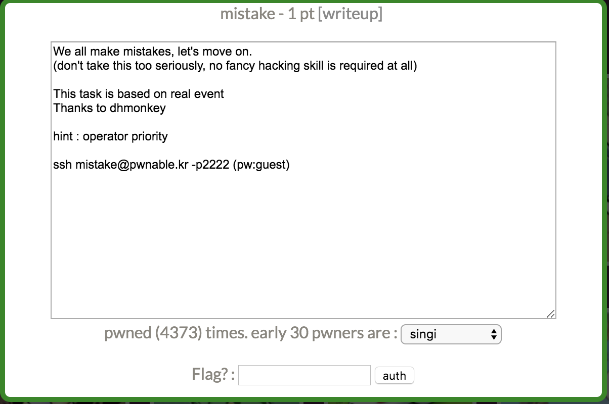
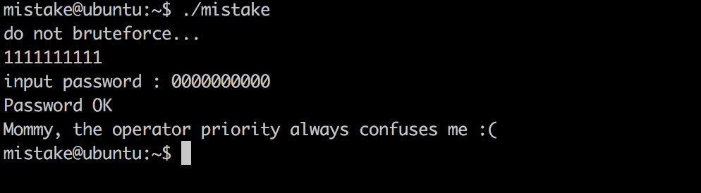
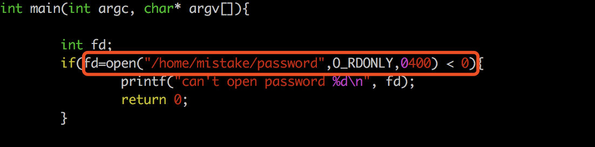

这关很有意思，题目本意是一道源码中运算符优先级导致的问题，如果直接看binary的话，看反编译代码就不会被运算符优先级迷惑。

先看一下反编译代码，main函数。程序判断/home/mistake/password能否打开，再没有别的文件打开的情况下open一般返回的fd是3。之后从stdin read 10byte，再用scanf读取10byte 进行xor运算，之后两者比较，如果相等就输出flag。

IDA pseudocode：

```cpp
int __cdecl main(int argc, const char **argv, const char **envp)
{
  int result; // eax
  int v4; // eax
  char buf; // [rsp+20h] [rbp-30h]
  char s2; // [rsp+30h] [rbp-20h]
  unsigned __int64 v7; // [rsp+48h] [rbp-8h]

  v7 = __readfsqword(0x28u);
  if ( open("/home/mistake/password", 0) >= 0 )
  {
    puts("do not bruteforce...");
    v4 = time(0LL);
    sleep(v4 % 20);
    if ( (signed int)read(0, &buf, 0xAuLL) > 0 )
    {
      printf("input password : ");
      __isoc99_scanf("%10s", &s2);
      xor((__int64)&s2, 10);
      if ( !strncmp(&buf, &s2, 0xAuLL) )
      {
        puts("Password OK");
        system("/bin/cat flag\n");
      }
      else
      {
        puts("Wrong Password");
      }
      close(0);
      result = 0;
    }
    else
    {
      puts("read error");
      close(0);
      result = 0;
    }
  }
  else
  {
    printf("can't open password %d\n");
    result = 0;
  }
  return result;
}
```

那么输入1111111111，0000000000即可。



再看一下题目源代码，发现了mistake。**fd=open("/home/mistake/password",O_RDONLY,0400) < 0**中，判断的优先级要比赋值的高，open返回值是3，那么fd的值就为假，也就是0了。

